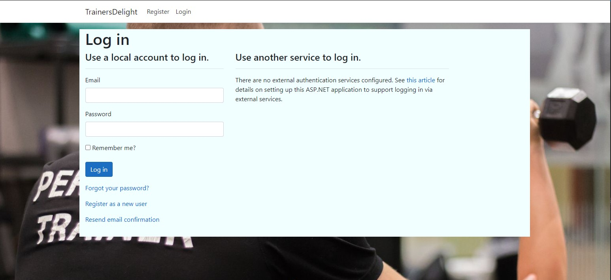
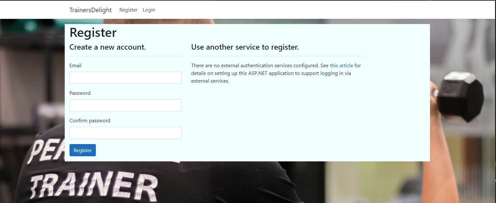
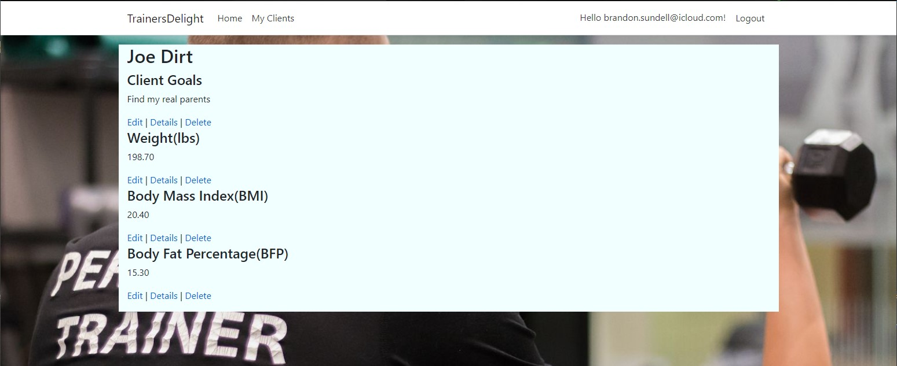

Describe project experience including each phase of the SDLC and the project artifacts (design documents, requirements trace, test reports...)
1. code and architecture walk-through
2. product demonstration
3. lessons learned:
4. what did you do right?
5. what did you do wrong?
6. where were you lucky?
7. what would you change / what do you know now that you wish you knew "then"?

### Login

### Register

### HomePage

### MyClients

### ClientProfile

# Lessons Learned:

## What I did right:
1. One thing I really feel like I understood and did right was the intergration of my database. I used the code first approch and I never really had any issues with my database. Also I was able to figure out how to edit, save, and update my database within Visual Studio which was a huge asset in the development process.

## What I did wrong:
1. I wish I would've focused on one task at a time completed that task and then moved on from there.
2. I should've reached out to my peers more. I found myself really wanting to figure it out on my own but I defently work better in collaberation with others.
3. I really enjoyed failing as hard as I did at times and the more I broke things at the begining the less I broke during the end.
4. I'm disapointed on how much time I had to spend on all the back-end which ended up in a very displeasing front end. I learned a huge lesson that Users do not care about what they can't see so I really wish I spent more time learning more of HTML & CSS.

## Where I got lucky:
There were many times when I was trying to implement a soulution and had no idea what I was doing and some how when I went to test it, it worked... 
1. The most memroable instance of this was when I was trying to implement Identity. I just started downloading the extentions and then migrated the DB and all of it populated so I chalked that up as a win and moved on, until i ran into different issues.
