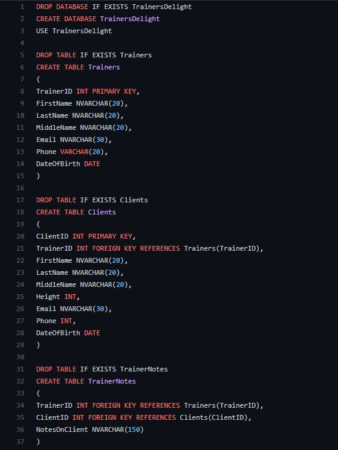
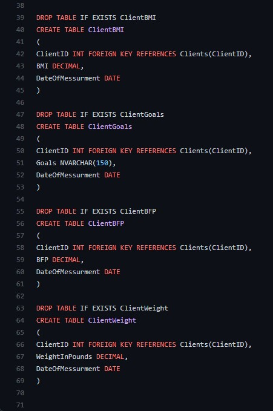
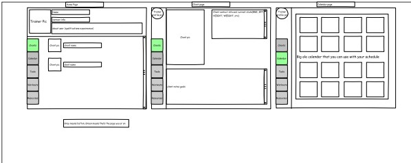
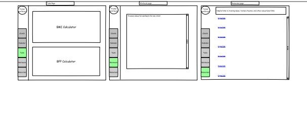

# TrainersDelight
ASP.Net web application to provide a easy and efficient way for personal trainers that work at local gyms to track and share client progress with other trainers.

### Table of Contents

1. [DataBase Schema](#database-schema)
2. [Requirements](#Requirments)
3. [WireFrame](#wireframe-diagram)
4. [Testing](#testing)
5. [Core Code](#core-code)

## [DataBase Schema](https://github.com/BrandonSundell/TrainersDelight/blob/main/TrainersDelightDatabaseSchema.sql)

[Top](#trainersdelight)

## [Requirements & Use Case](https://github.com/BrandonSundell/TrainersDelight/tree/main/Requirements)
[Top](#trainersdelight)

## WireFrame Diagram

[Top](#trainersdelight)

## Test Plan

### Requirement Table

|ReqId|Requirement|Test Method|
|-----|-----------|-----------|
|1|Authenticate trainer profile|Intergration| 
|2|Provide the trainer the ability to create new clients|Unit| 
|3|Allow the trainer to input client information|Unit| 
|4|Provide the means to calculate client health data such as body mass index and body fat percentage|Unit| 
|5|Track the progress of all inputted data of each client|System| 
|6|Allow the trianer the means of making notes about client sessions|Unit| 
|7|Provide a means of tracking individual client goals|System| 
|8|Provide a calendar to the trainer to track appointment dates and times|Unit|
|9|Allow for trainers to share client data in the case of leave or time off|System| 
|10|Allow the client to veiw their own progress|Acceptance| 

### Test table
|testId|ReqID|Test process|current state|Time|
|------|-----|---------|-------------|----|
|1|1,10|From the main login page enter user cridentials(username, password) should allow the user to access the application|Not Tested|N/A|
|2|2,3,4,6,8|In the application the user should be able to click the tabs on the left hand side and be able to interact and insert the data needed into that section of the app|Not Tested|N/A|
|3|5,7,9|In the application the data the user enters into area gets inserted into the SQL database with a time stamp and displayed on the page|Not Tested|N/A|

[Top](#trainersdelight)

## Core Code

### Prototype

[Link to code files from Visual Studio](https://github.com/BrandonSundell/TrainersDelight/tree/master/TrainersDelight)

[Top](#trainersdelight)
