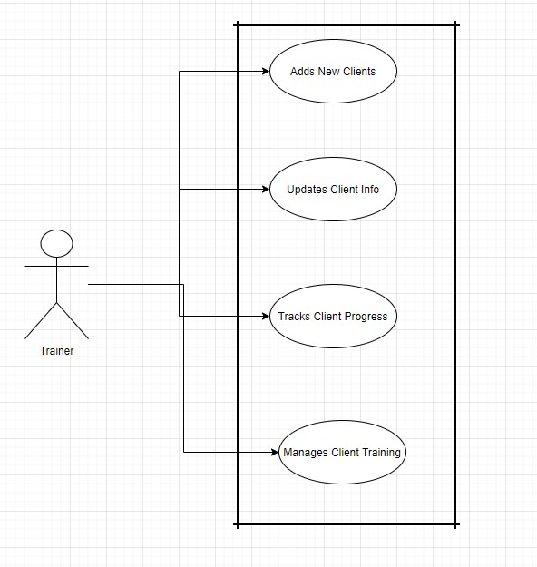

This folder contains User Stories, Use Cases, Use Case Diagrams, and Requirement Lists

# User Stories
1. As a personal trainer I want an application that allows me to track clients so that I can better find how to manage time and client base.
2. As a personal trainer I want an application that provides an easy way to calculate client Body Mass Index and Body Fat Percentages so that I can better talior 
client program needs
3. As a personal trainer I want an application that provides the means of tracking client goals so that I can provide the proper insight to help the 
client meet their health goals

# Use Cases
1. Given that the trainer gets a new client the trainer can add the client and all information to his directory
2. Given that the trainer cant be present the trainer has a log of the client progress to pass on to another trainer to pick up his apointments while said trainer is abbsent.
3. Given the trainer needs to dictate how to adjust the training program for a certian client the trainer can make a note of new ideas how to helo the client reach their goals.
4. Given the trainer needs to update client progress the trainer can log in and update the clients information and new found goals.

# UML

# Requirement List
The system shall 
1.  Authenticate trainer profile.
2.  Provide the trainer the ability to create new clients.
3.  Allow the trainer to input client information.
4.  Provide the means to calculate client health data such as body mass index and body fat percentage.
5.  Track the progress of all inputted data of each client.
6.  Allow the trianer the means of making notes about client sessions.
7.  Provide a means of tracking individual client goals.
8.  Provide a calendar to the trainer to track appointment dates and times.
9.  Allow for trainers to share client data in the case of leave or time off.
10.  Allow the client to veiw their own progress.
